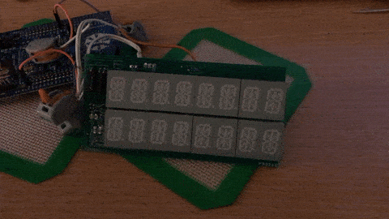

# max6955


A platform agnostic driver to interface with MAX6955 LED Display Driver



* [MAX6955 datasheet](https://datasheets.maximintegrated.com/en/ds/MAX6955.pdf)

## Example

A simple example with `stm32f3xx_hal`.

```rust
#![no_std]
#![no_main]
extern crate panic_halt;
pub use cortex_m::asm::bkpt;
use cortex_m_rt::entry;
use max6955::*;
use stm32f3xx_hal::{i2c::I2c, prelude::*, stm32};

#[entry]
fn main() -> ! {
    let dp = stm32::Peripherals::take().unwrap();
    let mut flash = dp.FLASH.constrain();
    let mut rcc = dp.RCC.constrain();
    let clocks = rcc.cfgr.freeze(&mut flash.acr);
    let mut gpiob = dp.GPIOB.split(&mut rcc.ahb);
    // configure I2C Clock Pin
    let scl = gpiob.pb6.into_af4(&mut gpiob.moder, &mut gpiob.afrl);
    // configure I2C Data Pin
    let sda = gpiob.pb7.into_af4(&mut gpiob.moder, &mut gpiob.afrl);
    // I2C interface
    let i2c = I2c::i2c1(dp.I2C1, (scl, sda), 10.khz(), clocks, &mut rcc.apb1);

    // create an instance with the default address 0x60
    let mut max6955 = Max6955::new(i2c).unwrap();
    // power up
    max6955.powerup().unwrap();
    // set intensity
    max6955.set_global_intensity(4).unwrap();
    // write text
    max6955.write_str("HELLO").unwrap();
    // enable slow blink effect
    max6955
        .set_blink(BlinkMode::Enable, BlinkRate::Slow)
        .unwrap();

    loop {}
}

```